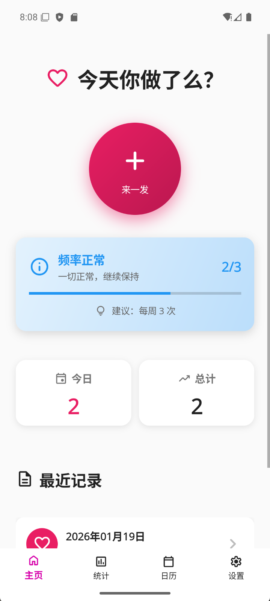
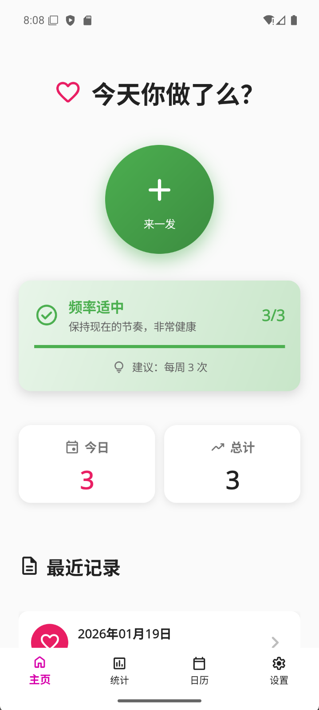
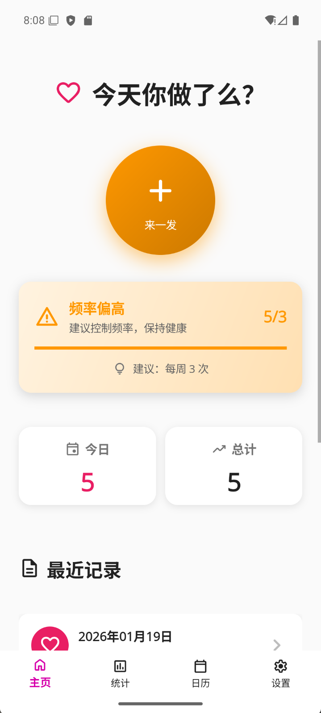
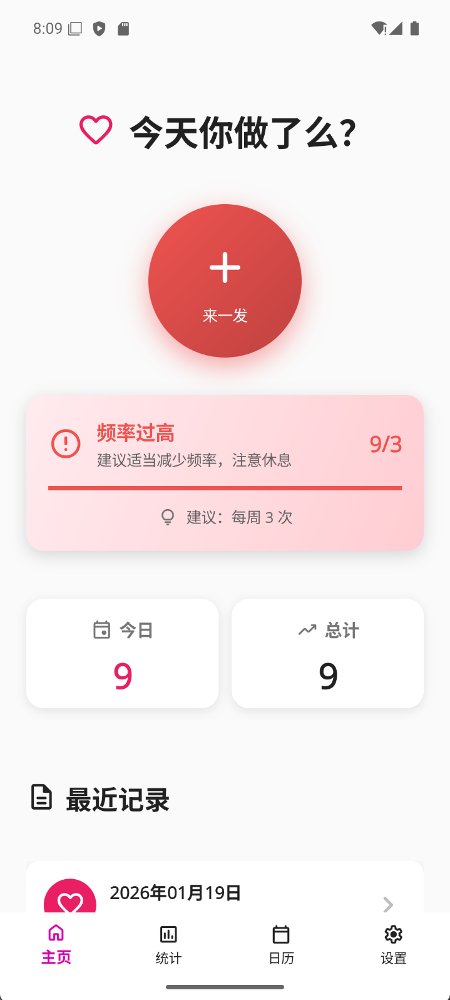
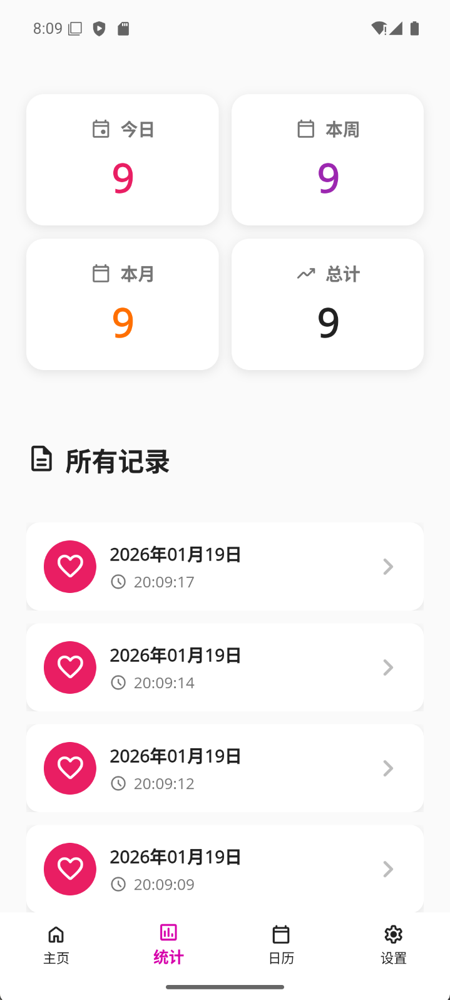
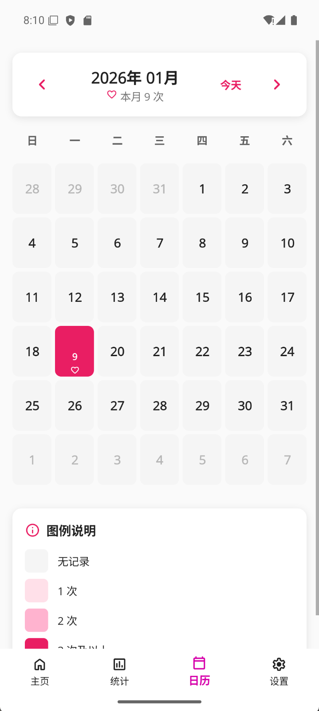
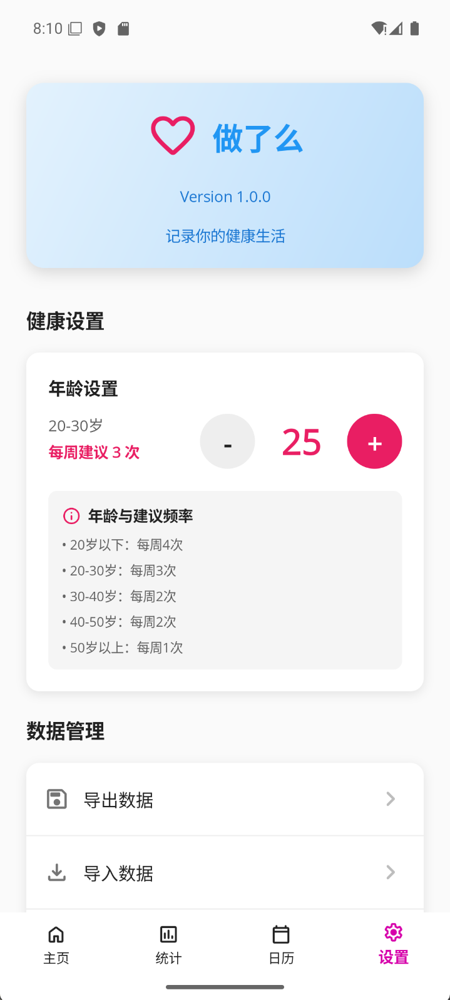
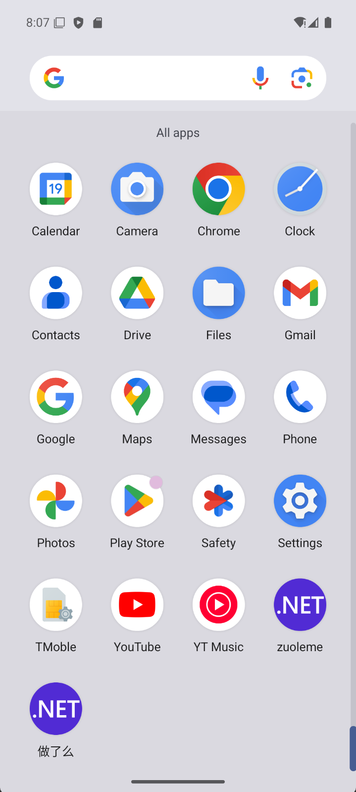

# 做了么 APP

做了么APP，支持android，ios，windows等。快下载体验吧

## ?? 应用截图

### 主界面
<table>
  <tr>
    <td><br/><center>主页 - 正常状态</center></td>
    <td><br/><center>主页 - 普通状态</center></td>
    <td><br/><center>主页 - 高频状态</center></td>
    <td><br/><center>主页 - 过度状态</center></td>
  </tr>
</table>

### 功能页面
<table>
  <tr>
    <td><br/><center>统计页面</center></td>
    <td><br/><center>日历视图</center></td>
    <td><br/><center>设置页面</center></td>
    <td><br/><center>应用图标</center></td>
  </tr>
</table>

## 功能特点

### 第一版功能
-  **一键记录**：点击中央大按钮快速添加记录
-  **统计展示**：实时显示今日、本周、本月和总计数据
- **历史记录**：查看所有记录的详细时间
-  **滑动删除**：左滑记录项可以删除
- **数据持久化**：所有数据保存在本地，保护隐私
-  **现代化界面**：使用 .NET MAUI 原生控件实现的现代化界面
- **底部导航**：三个标签页（主页、统计、设置）轻松切换

## 技术栈

- **.NET MAUI**：微软最新的跨平台框架
- **MVVM 架构**：Model-View-ViewModel 设计模式
- **依赖注入**：使用 DI 容器管理服务
- **数据持久化**：JSON 文件存储
- **现代 UI**：Border、Shadow、RoundRectangle 等现代控件
- **Shell 导航**：使用 MAUI Shell 实现底部 TabBar 导航

## UI 设计特性

### 现代化设计元素
- **阴影效果**：卡片和按钮带有精美的阴影
-  **圆角设计**：所有卡片和按钮使用圆角矩形
- **Emoji 图标**：使用 Unicode Emoji 作为视觉元素
- **响应式布局**：完美适配各种屏幕尺寸
- **Material 配色**：符合 Material Design 规范的配色方案
- **底部导航栏**：便捷的三页切换导航

## 项目结构

```
zuoleme/
├── Models/              # 数据模型
│   └── Record.cs       # 记录模型
├── Services/           # 业务服务
│   └── RecordService.cs # 记录管理服务
├── ViewModels/         # 视图模型
│   └── MainViewModel.cs # 主视图模型
├── Views/              # 页面视图
│   ├── HomePage.xaml   # 主页（记录）
│   ├── StatsPage.xaml  # 统计页
│   └── SettingsPage.xaml # 设置页
├── AppShell.xaml       # Shell 导航配置
└── Resources/          # 资源文件
    └── Styles/         # 样式和颜色
```


## 运行要求

- **.NET 10**
- **iOS**：15.0+
- **Android**：API 21+
- **Windows**：Windows 10 (17763+)
- **macOS**：macOS 15.0+ (Catalyst)

## 如何运行

### Windows
```bash
dotnet build -f net10.0-windows10.0.19041.0
dotnet run -f net10.0-windows10.0.19041.0
```

### Android
```bash
dotnet build -f net10.0-android
dotnet run -f net10.0-android
```

### iOS
```bash
dotnet build -f net10.0-ios
dotnet run -f net10.0-ios
```

## UI 组件展示

### 使用的 .NET MAUI 控件
1. **Shell** - 应用导航和底部 TabBar
2. **TabBar** - 底部标签栏导航
3. **Border** - 带阴影和圆角的边框容器
4. **Shadow** - 阴影效果
5. **RoundRectangle** - 圆角矩形形状
6. **SwipeView** - 滑动操作视图
7. **CollectionView** - 高性能列表
8. **Grid** - 网格布局


## 未来计划

- [ ] 添加备注功能
- [ ] 数据导出和导入功能
- [ ] 统计图表可视化
- [ ] 提醒功能
- [ ] 深色模式
- [ ] 密码保护功能实现
- [ ] 云同步（可选）
- [ ] 更多统计维度（年度、自定义时间段）
- [ ] 数据可视化（趋势图、日历热力图）
- [ ] 清空数据功能实现
- [ ] 使用说明页面
- [ ] 版本更新检查

## 技术亮点
 **纯 .NET MAUI** - 不依赖第三方 UI 库  
**Shell 导航** - 使用 MAUI Shell 实现现代导航  
 **现代设计** - 使用最新的 MAUI 控件（Border、Shadow 等）  
 **三页架构** - 主页、统计、设置清晰分离  
 **跨平台一致** - 所有平台统一的视觉体验  
 **轻量高效** - 无额外依赖，启动快速  
 **易于维护** - 代码简洁，结构清晰  
 **MVVM 模式** - 数据绑定和命令模式  

## 隐私声明

本应用所有数据仅存储在您的设备本地，不会上传到任何服务器。我们重视并保护您的隐私。
